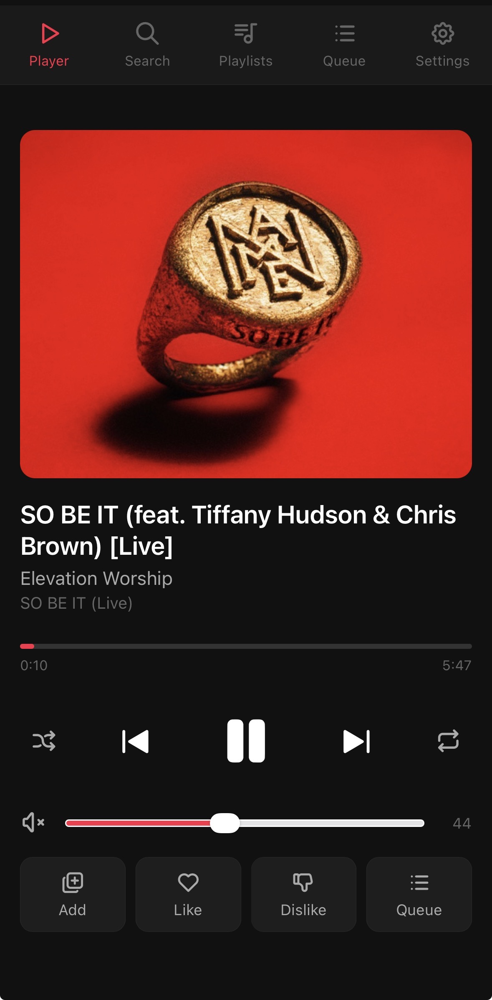

# Cider Remote

A self-hosted Apple Music remote control webapp for [Cider](https://cider.sh), accessible from any device on your network via a mobile-friendly web interface.



Built with a Python proxy server and vanilla HTML/JS. No frameworks, no dependencies beyond Python 3.

> **Disclaimer:** This is an independent, unofficial project and is not developed, supported or endorsed by Cider Collective. It works by utilizing the local RPC API that Cider exposes, as documented at [cider.sh/docs/client/rpc](https://cider.sh/docs/client/rpc). Use it at your own discretion.

---

## TL;DR

1. Purchase and install [Cider](https://cider.sh) ($3.29 USD) on your Linux machine
2. Enable the RPC server in Cider: **Settings → Connectivity → Manage External Application Access**
3. Copy your API token from the same menu
4. Set up the proxy server and serve the webapp
5. Open in any browser on your network, go to Settings, and paste your token

```bash
mkdir ~/cider-remote
cd ~/cider-remote
# Place server.py, index.html, lang/ folder, favicon.svg and apple-touch-icon.png here
python3 server.py
# Open http://your-linux-ip:8080
```

---

## Features

- Now playing with album art
- Play/pause, next, previous
- Shuffle and repeat toggle
- Seek bar with time display
- Volume control with mute
- Search songs, albums and artists in the Apple Music catalog
- Browse artist albums
- Library playlists
- Play queue with current track highlight
- Add to library and like/dislike ratings
- Multi-language support (Norwegian and English)
- Configurable API token and Apple Music storefront via settings page

---

## Requirements

- Linux (tested on Pop!_OS 22.04)
- [Cider](https://cider.sh) installed and running
- Python 3.6+
- A browser on any device on the same network (or via VPN/Tailscale)

---

## Installation

### 1. Install Cider

Cider is a paid Apple Music client available for $3.29 USD from [cider.sh](https://cider.sh). After purchasing, download the `.deb` package and install it:

```bash
sudo dpkg -i cider-*.deb
sudo apt --fix-broken install
```

### 2. Enable the Cider RPC server

Open Cider and navigate to **Settings → Connectivity → Manage External Application Access to Cider**. Make sure the RPC server is enabled, then copy your API token — you will need it later.

### 3. Set up the remote

Create a directory and place all files there:

```bash
mkdir -p ~/cider-remote
```

The directory should contain the following files:

```
cider-remote/
├── index.html
├── server.py
├── favicon.svg
├── apple-touch-icon.png
└── lang/
    ├── no.json
    └── en.json
```

### 4. Start the server

```bash
python3 ~/cider-remote/server.py
```

Open `http://your-linux-ip:8080` in a browser, go to **Settings**, and paste your API token.

---

## Running automatically on boot

### Proxy server (systemd)

The proxy server does not need a graphical environment and can run as a systemd user service:

```bash
mkdir -p ~/.config/systemd/user

cat > ~/.config/systemd/user/cider-remote.service << 'EOF'
[Unit]
Description=Cider Remote Proxy
After=default.target

[Service]
ExecStart=/usr/bin/python3 /home/YOUR_USER/cider-remote/server.py
Restart=on-failure
RestartSec=5
WorkingDirectory=/home/YOUR_USER/cider-remote

[Install]
WantedBy=default.target
EOF

systemctl --user daemon-reload
systemctl --user enable cider-remote.service
systemctl --user start cider-remote.service
```

Replace `YOUR_USER` with your username.

### Cider (autostart)

Cider is an Electron app and requires a graphical session. Use GNOME autostart instead of systemd:

```bash
mkdir -p ~/.config/autostart

cat > ~/.config/autostart/cider.desktop << 'EOF'
[Desktop Entry]
Type=Application
Name=Cider
Exec=/usr/bin/cider
Hidden=false
NoDisplay=false
X-GNOME-Autostart-enabled=true
EOF
```

### Automatic login (optional)

If the machine is headless or unattended, enable automatic login so Cider can start without manual intervention. On GNOME/GDM:

```bash
sudo tee -a /etc/gdm3/custom.conf << 'EOF'
[daemon]
AutomaticLoginEnable=True
AutomaticLogin=YOUR_USER
EOF
```

It is recommended to also enable a screen lock after a short idle period:

```bash
gsettings set org.gnome.desktop.session idle-delay 300
gsettings set org.gnome.desktop.screensaver lock-enabled true
gsettings set org.gnome.desktop.screensaver lock-delay 0
```

---

## HTTPS with nginx

To serve the remote over HTTPS using a custom domain, set up nginx as a reverse proxy.

### Prerequisites

- A domain pointing to your server's local IP (via local DNS, e.g. Pi-hole)
- A valid SSL certificate for your domain (e.g. Let's Encrypt wildcard)

### Install and configure nginx

```bash
sudo apt install nginx -y
sudo mkdir -p /etc/nginx/certs

sudo cp your-fullchain.pem /etc/nginx/certs/
sudo cp your-privkey.key /etc/nginx/certs/
sudo chmod 600 /etc/nginx/certs/your-privkey.key

sudo tee /etc/nginx/sites-available/cider-remote << 'EOF'
server {
    listen 80;
    server_name remote.yourdomain.com;
    return 301 https://$host$request_uri;
}

server {
    listen 443 ssl;
    server_name remote.yourdomain.com;

    ssl_certificate /etc/nginx/certs/your-fullchain.pem;
    ssl_certificate_key /etc/nginx/certs/your-privkey.key;

    location / {
        proxy_pass http://localhost:8080;
        proxy_set_header Host $host;
        proxy_set_header X-Real-IP $remote_addr;
    }
}
EOF

sudo ln -s /etc/nginx/sites-available/cider-remote /etc/nginx/sites-enabled/
sudo nginx -t
sudo systemctl enable nginx
sudo systemctl restart nginx
```

Replace `remote.yourdomain.com` with your actual domain.

---

## Port forwarding (optional)

To avoid specifying port 8080 in the URL, forward port 80 to 8080 using iptables:

```bash
sudo apt install iptables-persistent -y
sudo iptables -t nat -A PREROUTING -p tcp --dport 80 -j REDIRECT --to-port 8080
sudo netfilter-persistent save
```

This is not needed if you are using nginx.

---

## Static IP reservation

To ensure your Linux machine always gets the same IP, add a DHCP static mapping on your router using the machine's MAC address.

Find your WiFi adapter's MAC address:

```bash
ip link show
```

Look for the interface marked `UP` and note the `link/ether` value. Then add a static mapping in your router's admin interface using that MAC address and your preferred IP.

---

## Accessing from outside your network

The remote works over any network as long as you can reach the server:

- **Local network**: access via IP or local DNS directly
- **Tailscale**: install on both your phone and the server for encrypted access from anywhere without port forwarding
- **VPN**: any VPN that routes traffic through your home network

---

## Settings

The settings page is available via the gear icon in the navigation bar.

| Setting | Description |
|---|---|
| API token | Token from Cider's connectivity settings. Only needs to be entered when setting up or after token regeneration. |
| Language | Interface language (Norwegian or English) |
| Apple Music region | Storefront used for catalog search (`no` for Norway, `us` for United States, etc.) |

Settings are saved to `config.json` in the project directory. The token is never sent to the browser — it is stored server-side and injected into API requests by the proxy.

---

## Adding to iPhone home screen

1. Open the remote URL in Safari
2. Tap the share icon (box with arrow)
3. Select **Add to Home Screen**
4. Give it a name and tap **Add**

The `apple-touch-icon.png` file is used as the home screen icon.

---

## Troubleshooting

**502 Bad Gateway**
Cider is not running. Start it manually or check that the autostart entry is in place and that you are logged in.

**"No API token set"**
Go to Settings and paste your token from Cider's connectivity settings.

**"Could not connect to Cider"**
The token is set but Cider is not responding on port 10767. Check that Cider is open and that the RPC server is enabled in its settings.

**Songs don't start automatically after selecting**
The remote retries up to 5 times over ~4 seconds. If playback still does not start, tap the play button manually.

**Search returns no results**
Make sure the Apple Music region in Settings matches your subscription country.

**Proxy service stopped unexpectedly**
Check the service status and restart if needed:

```bash
systemctl --user status cider-remote.service
systemctl --user restart cider-remote.service
```

---

## Security considerations

This project is intended for personal use on a trusted local network. Before deploying, make sure you understand the following:

**Automatic login**
Enabling automatic login means anyone with physical access to the machine can use it without a password. Only do this if the machine is in a physically secure location. A screen lock with a short idle timeout is strongly recommended to mitigate this risk.

**Remote access (Tailscale/VPN)**
Exposing the remote over Tailscale or a VPN allows you to control your music from anywhere, but it also means the service is reachable outside your home network. Make sure your Tailscale ACLs or VPN configuration only allow trusted devices to connect. Never expose port 8080 or 443 directly to the public internet without proper authentication.

**API token**
The API token grants full control over Cider playback. It is stored in plaintext in `config.json` on the server. Do not share this file or commit it to version control. Add `config.json` to your `.gitignore`.

**No authentication**
The remote has no login screen. Anyone who can reach the URL can control playback. On a home network this is usually acceptable, but keep this in mind if you share your network with others or expose the service remotely.

The author takes no responsibility for any security issues arising from misconfiguration or use of this software. You set up and operate this service at your own risk.

---

## How it works

The proxy server (`server.py`) runs on port 8080 and serves the static HTML frontend. API calls from the browser are forwarded to Cider's local RPC server on port 10767 with the API token injected server-side. This means the token is never exposed to the browser or network.

Cider's RPC API is documented at [cider.sh/docs/client/rpc](https://cider.sh/docs/client/rpc).

---

## License

MIT
